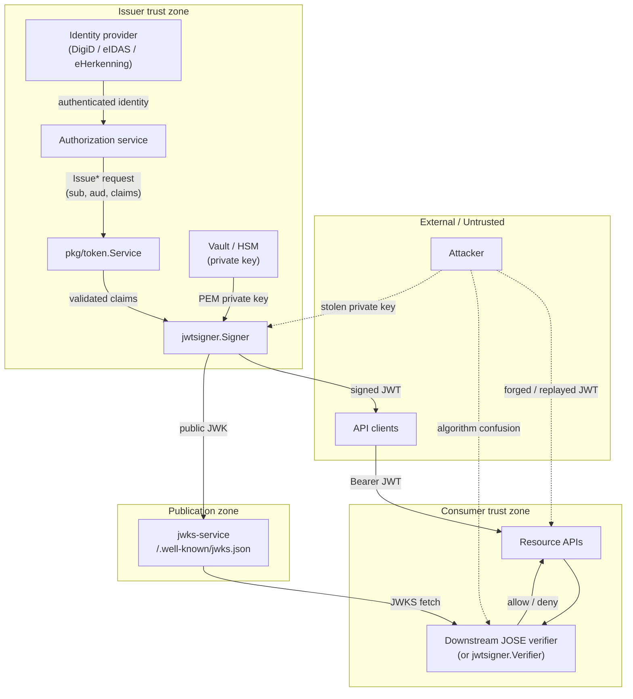

# Threat model — gov-jwt-signer

This document describes the security posture of **gov-jwt-signer**, a Go library
used inside authorization services to sign government identity JWTs (eIDAS,
DigiD, eHerkenning, and custom variants). It follows a lightweight STRIDE-style
analysis focused on trust boundaries and the controls implemented in this module.

For vulnerability reporting, see [SECURITY.md](../SECURITY.md).

## System context

gov-jwt-signer is **not** a standalone service. It is embedded in an
authorization service that:

1. Authenticates users via an upstream identity provider.
2. Assembles claims through `pkg/token.Service`.
3. Signs tokens with `jwtsigner.Signer` using a private key from Vault/HSM.
4. Publishes public keys via a separate JWKS endpoint (typically
   [jwks-service](https://github.com/sirrapa-it/jwks-service)).

Downstream resource APIs validate tokens with their own JOSE stack. The bundled
`jwtsigner.Verifier` exists for self-testing and lightweight consumers.

### Architecture diagram

The canonical diagram source lives in [threat-model.mmd](./threat-model.mmd).
Rendered view:

## Assets

| Asset | Sensitivity | Owner |
|-------|-------------|-------|
| Private signing key | Critical | Vault / HSM |
| Issued JWTs (PII, BSN, pseudonyms) | High | Authorization service |
| JWKS (public keys) | Medium | jwks-service |
| `iss`, `aud`, `acr`, `token_type` policy | High | Integrator |

## Trust boundaries

| Boundary | Trusted side | Untrusted side | Library role |
|----------|--------------|----------------|--------------|
| TB-1 | Authorization service | API clients | Signs tokens; does not receive client JWTs |
| TB-2 | Vault / HSM | Application memory | Key loaded via integrator configuration |
| TB-3 | Identity provider | Authorization service | Out of scope; integrator must authenticate first |
| TB-4 | JWKS publisher | Verifiers | `Signer.JWKS()` for self-test; production JWKS is external |
| TB-5 | Verifier | Presented JWT | `Verifier` validates signature and standard claims |

## STRIDE analysis

### Spoofing (authentication)

| Threat | Description | Mitigation in library | Residual risk |
|--------|-------------|----------------------|---------------|
| S-1 | Attacker forges JWT without private key | Asymmetric signatures (RS*/PS*/ES*); tamper tests | None if key is protected |
| S-2 | Attacker reuses token for another service | `Service` requires `aud` on every issued token | Verifier must still enforce `aud` |
| S-3 | Weak signing key brute-forced | `NewSigner` rejects RSA &lt; 2048 bits | Integrator must protect key material |

### Tampering (integrity)

| Threat | Description | Mitigation in library | Residual risk |
|--------|-------------|----------------------|---------------|
| T-1 | Modify claims after signing | JWS signature verification | Low |
| T-2 | Algorithm confusion (`none`, HS256) | `jwt/v5` type checks; JWKS `alg` required; allowlist always applied | Low |
| T-3 | Alternate RSA/PSS algorithm downgrade | Each JWK must include `alg`; `WithValidMethods` enforced | Low |
| T-4 | Malicious EC JWK (off-curve point) | `IsOnCurve` check when parsing EC keys | Low |
| T-5 | Duplicate `kid` in JWKS | `NewVerifier` rejects duplicate kids | Low |

### Repudiation

| Threat | Description | Mitigation in library | Residual risk |
|--------|-------------|----------------------|---------------|
| R-1 | Issuer denies having signed a token | `iss`, `iat`, `jti` on every `Service` token; 128-bit random `jti` | Integrator should log issuance events |

### Information disclosure

| Threat | Description | Mitigation in library | Residual risk |
|--------|-------------|----------------------|---------------|
| I-1 | Private key in repository | `.gitignore` excludes `*.pem`; keys via file/PEM options only | Integrator discipline |
| I-2 | PII over-minimisation failure | DigiD docs recommend pseudonym over BSN | Integrator data-minimisation policy |
| I-3 | Error messages leak internals | Sentinel errors without key material | Low |

### Denial of service

| Threat | Description | Mitigation in library | Residual risk |
|--------|-------------|----------------------|---------------|
| D-1 | Oversized JWT payloads | Not limited in library | Consumer should cap token size |
| D-2 | Very long TTL tokens | Default 5 minutes; no max TTL cap | Integrator should cap `TTL` |

### Elevation of privilege

| Threat | Description | Mitigation in library | Residual risk |
|--------|-------------|----------------------|---------------|
| E-1 | Inflated `acr` / assurance level | Built-in variants validate LoA; `acr` derived from level | `IssueCustom` allows arbitrary `acr` — integrator responsibility |
| E-2 | Reserved claim overwrite | `ClaimsKey` cannot collide with `iss`, `sub`, `aud`, etc. | Low |
| E-3 | Bypass `Service` via `Signer.Sign()` | Low-level API by design; `Verifier` enforces `exp` and optional `iss`/`aud` | Integrator should use `Service` for issuance |

## Security controls (library)

### Signing (`jwtsigner.Signer`)

- Asymmetric algorithms only (RS256 default, NL GOV Assurance baseline).
- Key type must match algorithm (RSA vs EC).
- Minimum strength: RSA ≥ 2048 bits; EC on P-256, P-384, or P-521.
- Header: `alg`, `typ=JWT`, `kid`.
- `jti`: 128 bits from `crypto/rand`.

### Issuance (`pkg/token.Service`)

- Requires `sub` and `aud` on every token.
- Built-in variants validate domain claims before signing.
- `IssueCustom` supports `Validate()` on consumer payloads.
- Reserved top-level claim names cannot be overwritten via `ClaimsKey`.

### Verification (`jwtsigner.Verifier`)

- Every JWK must have `kid` and `alg`.
- Algorithm allowlist derived from JWKS (no silent bypass).
- Duplicate `kid` values rejected.
- Required `exp`; optional `iss` and `aud` enforcement.
- EC public keys validated on-curve at parse time.

## Integrator checklist

Use this when embedding the library in production:

- [ ] Private key stored in Vault/HSM; never committed to source control.
- [ ] Authentication completed **before** calling any `Issue*` method.
- [ ] Every token issued with an explicit, service-specific `aud`.
- [ ] TTL kept short; align with organizational policy (default 5 minutes).
- [ ] JWKS published only via the trusted jwks-service endpoint.
- [ ] Downstream verifiers check `aud`, `token_type`, variant claims, and `acr`.
- [ ] For `IssueCustom`, validate `acr` and implement `Validate()` on claims.
- [ ] Keep Go toolchain and `golang-jwt/jwt/v5` updated (`govulncheck` in CI).

## Out of scope

The following are **integrator / deployment** responsibilities, not enforced
by this library:

- Network TLS for Vault or JWKS fetches (see `examples/vault-sign`).
- Rate limiting, audit logging, and token revocation.
- `token_type` and variant-claim validation at verify time.
- Maximum TTL and JWT size limits.
- Identity-provider authentication and session management.

## References

- RFC 7515 (JWS), RFC 7517 (JWK), RFC 7518 (JWA), RFC 7519 (JWT), RFC 7638 (thumbprint)
- NL GOV Assurance profile for OAuth 2.0
- eIDAS Regulation (EU) 910/2014
- [SECURITY.md](../SECURITY.md) — vulnerability reporting and principles
